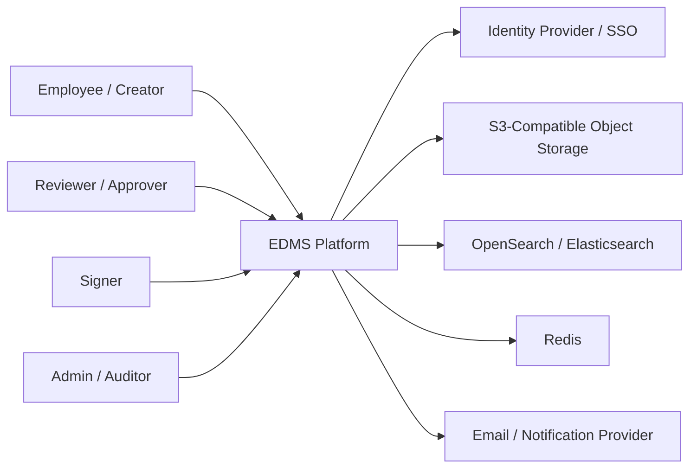
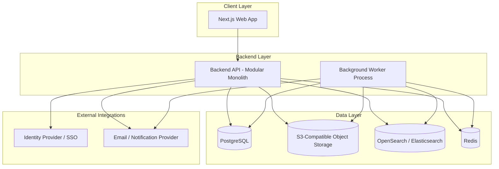
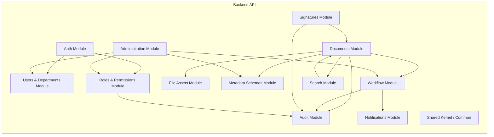
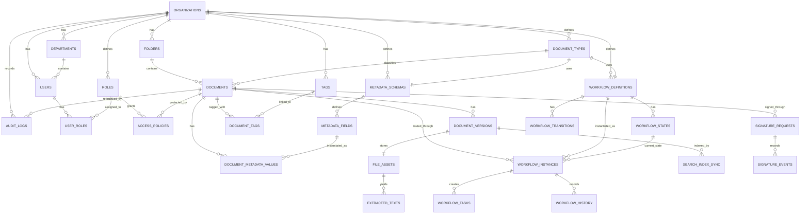

# EDMS / GED / IRS System Design Document

## 1. Overview

### Product purpose
This system is an Electronic Document Management System (EDMS) that enables organizations to create, upload, store, retrieve, version, route, secure, and audit documents throughout their lifecycle.

### Phase covered
This document defines the MVP and foundation architecture for phase 1. AI and agentic features are intentionally excluded from the core design, but extension points are preserved for later adoption.

### Architecture choice
- **Architecture style:** Modular monolith
- **Frontend:** React / Next.js
- **Backend:** NestJS or Spring Boot
- **Database:** PostgreSQL
- **Binary storage:** S3-compatible object storage
- **Search engine:** OpenSearch / Elasticsearch
- **Asynchronous processing:** Redis + background workers

### Core domains
- Users
- Roles
- Departments
- Documents
- Document Versions
- File Assets
- Metadata Schemas
- Workflows
- Permissions
- Signatures
- Audit Logs

---

## 2. Goals

### Functional goals
- Create and upload documents
- Organize documents into folders or workspaces
- Manage document versions
- Apply metadata schemas and document typing
- Route documents through workflows
- Request and record signatures
- Search by metadata and full text
- Secure document access with role and resource-level rules
- Keep complete audit trails

### Non-functional goals
- Strong security boundaries
- Clear modularity for maintainability
- Fast retrieval and search
- Reliable async processing for heavy tasks
- Low operational complexity compared with microservices
- Straightforward path to later scale and extraction of services

---

## 3. Scope

### In scope for MVP
- authentication and user management
- department hierarchy
- roles and permissions
- document and folder management
- versioning
- file storage integration
- metadata schema support
- basic workflow engine
- signature request tracking
- audit logging
- indexing and search
- notification hooks

### Out of scope for phase 1
- AI summarization, classification, and extraction logic
- agentic automation
- NotebookLM-style notebook layer
- advanced external e-sign integrations
- deep records-management and legal-hold automation

---

## 4. C4 Architecture

### 4.1 Level 1 – System Context



### 4.2 Level 2 – Container Diagram



### 4.3 Level 3 – Component Diagram



---

## 5. Module Responsibilities

### Auth Module
- authentication
- session or JWT handling
- current-user resolution
- SSO integration point

### Users & Departments Module
- user CRUD
- department CRUD and hierarchy
- org-scoped user listing

### Roles & Permissions Module
- role CRUD
- permission catalog
- user role assignment
- access policy evaluation

### Documents Module
- document aggregate lifecycle
- folder placement
- version management orchestration
- status management

### File Assets Module
- upload bookkeeping
- object storage paths
- checksum management
- preview / thumbnail references

### Metadata Schemas Module
- metadata schemas
- schema fields
- validation rules
- typed metadata values

### Workflow Module
- workflow definitions
- states and transitions
- workflow instances and history
- task assignment

### Signatures Module
- signature requests
- signature event history
- signer assignments

### Search Module
- index synchronization
- full-text and faceted search
- result ranking and filters

### Audit Module
- append-only audit trail
- event publication and querying

### Notifications Module
- workflow alerts
- signature notifications
- reminder hooks

### Administration Module
- reference data management
- system configuration
- document types and workflow setup

---

## 6. Domain Model

### Core design rule
A **Document** is the business entity.
A **Document Version** is a point-in-time official revision.
A **File Asset** is the physical binary stored in object storage.

This separation ensures that version history, metadata, and workflow remain stable even when the binary file changes.

---

## 7. Database ERD



---

## 8. Core Tables

### Organizations
| Column | Type | Notes |
|---|---|---|
| id | uuid | PK |
| name | varchar | |
| code | varchar | unique |
| status | varchar | active, suspended |
| created_at | timestamptz | |
| updated_at | timestamptz | |

### Departments
| Column | Type | Notes |
|---|---|---|
| id | uuid | PK |
| organization_id | uuid | FK |
| parent_department_id | uuid nullable | self-reference |
| name | varchar | |
| code | varchar nullable | |
| created_at | timestamptz | |
| updated_at | timestamptz | |

### Users
| Column | Type | Notes |
|---|---|---|
| id | uuid | PK |
| organization_id | uuid | FK |
| department_id | uuid nullable | FK |
| first_name | varchar | |
| last_name | varchar | |
| email | varchar | unique within org |
| phone | varchar nullable | |
| status | varchar | active, invited, disabled |
| password_hash / identity_provider_id | varchar | auth-mode specific |
| created_at | timestamptz | |
| updated_at | timestamptz | |

### Roles
| Column | Type | Notes |
|---|---|---|
| id | uuid | PK |
| organization_id | uuid | FK |
| name | varchar | |
| code | varchar | unique per org |
| description | text | |
| created_at | timestamptz | |

### UserRoles
| Column | Type | Notes |
|---|---|---|
| user_id | uuid | FK |
| role_id | uuid | FK |
| scope_type | varchar nullable | organization, department, folder |
| scope_id | uuid nullable | |
| assigned_at | timestamptz | |

### AccessPolicies
| Column | Type | Notes |
|---|---|---|
| id | uuid | PK |
| resource_type | varchar | document, folder, department |
| resource_id | uuid | |
| principal_type | varchar | user, role, department |
| principal_id | uuid | |
| permission_code | varchar | ex: document.view |
| effect | varchar | allow, deny |
| created_at | timestamptz | |

### Folders
| Column | Type | Notes |
|---|---|---|
| id | uuid | PK |
| organization_id | uuid | FK |
| parent_folder_id | uuid nullable | self-reference |
| name | varchar | |
| owner_user_id | uuid nullable | |
| visibility_type | varchar | private, department, shared |
| created_at | timestamptz | |
| updated_at | timestamptz | |

### DocumentTypes
| Column | Type | Notes |
|---|---|---|
| id | uuid | PK |
| organization_id | uuid | FK |
| name | varchar | |
| code | varchar | |
| metadata_schema_id | uuid | FK |
| workflow_definition_id | uuid nullable | FK |
| retention_policy_code | varchar nullable | future |
| created_at | timestamptz | |

### Documents
| Column | Type | Notes |
|---|---|---|
| id | uuid | PK |
| organization_id | uuid | FK |
| folder_id | uuid nullable | FK |
| document_type_id | uuid | FK |
| owner_user_id | uuid | FK |
| created_by | uuid | FK |
| title | varchar | |
| description | text nullable | |
| status | varchar | draft, under_review, approved, signed, archived |
| confidentiality_level | varchar | internal, restricted, confidential |
| current_version_id | uuid nullable | FK |
| archived_at | timestamptz nullable | |
| created_at | timestamptz | |
| updated_at | timestamptz | |

### DocumentVersions
| Column | Type | Notes |
|---|---|---|
| id | uuid | PK |
| document_id | uuid | FK |
| version_number | integer | sequential per document |
| file_asset_id | uuid | FK |
| change_summary | text nullable | |
| is_major_version | boolean | |
| created_by | uuid | FK |
| created_at | timestamptz | |

### FileAssets
| Column | Type | Notes |
|---|---|---|
| id | uuid | PK |
| storage_provider | varchar | s3, minio |
| bucket_name | varchar | |
| object_key | varchar | unique |
| original_filename | varchar | |
| mime_type | varchar | |
| size_bytes | bigint | |
| checksum_sha256 | varchar | |
| encryption_status | varchar | |
| upload_status | varchar | pending, completed, failed |
| preview_object_key | varchar nullable | |
| thumbnail_object_key | varchar nullable | |
| created_at | timestamptz | |

### MetadataSchemas
| Column | Type | Notes |
|---|---|---|
| id | uuid | PK |
| organization_id | uuid | FK |
| name | varchar | |
| version | integer | |
| created_at | timestamptz | |

### MetadataFields
| Column | Type | Notes |
|---|---|---|
| id | uuid | PK |
| schema_id | uuid | FK |
| field_name | varchar | machine-safe |
| field_label | varchar | UI label |
| data_type | varchar | text, number, date, boolean, enum, json |
| is_required | boolean | |
| is_searchable | boolean | |
| validation_rules | jsonb | |
| display_order | integer | |

### DocumentMetadataValues
| Column | Type | Notes |
|---|---|---|
| id | uuid | PK |
| document_id | uuid | FK |
| metadata_field_id | uuid | FK |
| value_text | text nullable | |
| value_number | numeric nullable | |
| value_date | date nullable | |
| value_boolean | boolean nullable | |
| value_json | jsonb nullable | |

### WorkflowDefinitions
| Column | Type | Notes |
|---|---|---|
| id | uuid | PK |
| organization_id | uuid | FK |
| name | varchar | |
| version | integer | |
| is_active | boolean | |
| created_at | timestamptz | |

### WorkflowStates
| Column | Type | Notes |
|---|---|---|
| id | uuid | PK |
| workflow_definition_id | uuid | FK |
| state_code | varchar | draft, review, approved |
| state_name | varchar | |
| is_initial | boolean | |
| is_terminal | boolean | |

### WorkflowTransitions
| Column | Type | Notes |
|---|---|---|
| id | uuid | PK |
| workflow_definition_id | uuid | FK |
| from_state_id | uuid | FK |
| to_state_id | uuid | FK |
| action_code | varchar | submit, approve, reject |
| requires_comment | boolean | |
| allowed_role_id | uuid nullable | FK |

### WorkflowInstances
| Column | Type | Notes |
|---|---|---|
| id | uuid | PK |
| document_id | uuid | FK |
| workflow_definition_id | uuid | FK |
| current_state_id | uuid | FK |
| started_by | uuid | FK |
| started_at | timestamptz | |
| completed_at | timestamptz nullable | |

### WorkflowTasks
| Column | Type | Notes |
|---|---|---|
| id | uuid | PK |
| workflow_instance_id | uuid | FK |
| assigned_to_user_id | uuid | FK |
| task_type | varchar | review, approve, sign |
| status | varchar | pending, completed, cancelled |
| due_at | timestamptz nullable | |
| completed_at | timestamptz nullable | |
| comments | text nullable | |

### WorkflowHistory
| Column | Type | Notes |
|---|---|---|
| id | uuid | PK |
| workflow_instance_id | uuid | FK |
| from_state_id | uuid nullable | FK |
| to_state_id | uuid nullable | FK |
| action_code | varchar | |
| performed_by | uuid | FK |
| remarks | text nullable | |
| performed_at | timestamptz | |

### SignatureRequests
| Column | Type | Notes |
|---|---|---|
| id | uuid | PK |
| document_id | uuid | FK |
| version_id | uuid | FK |
| requested_by | uuid | FK |
| signer_user_id | uuid | FK |
| status | varchar | pending, signed, declined, expired |
| requested_at | timestamptz | |
| completed_at | timestamptz nullable | |

### SignatureEvents
| Column | Type | Notes |
|---|---|---|
| id | uuid | PK |
| signature_request_id | uuid | FK |
| event_type | varchar | requested, viewed, signed, declined |
| performed_by | uuid nullable | FK |
| payload_json | jsonb nullable | |
| event_at | timestamptz | |

### SearchIndexSync
| Column | Type | Notes |
|---|---|---|
| id | uuid | PK |
| document_id | uuid | FK |
| version_id | uuid | FK |
| index_status | varchar | pending, indexed, failed |
| last_indexed_at | timestamptz nullable | |
| error_message | text nullable | |

### AuditLogs
| Column | Type | Notes |
|---|---|---|
| id | uuid | PK |
| organization_id | uuid | FK |
| actor_user_id | uuid nullable | FK |
| action_type | varchar | DOCUMENT_CREATED, VIEWED, APPROVED |
| resource_type | varchar | document, workflow, user, role |
| resource_id | uuid nullable | |
| metadata_json | jsonb nullable | |
| ip_address | inet nullable | |
| user_agent | text nullable | |
| created_at | timestamptz | |

---

## 9. Key Business Rules

### Documents
- A document belongs to one organization.
- A document has one current version pointer.
- New uploads for an existing document create a new version.
- Document type may require metadata validation before submission.

### Versions
- Version numbers are sequential per document.
- Versions are immutable once created.
- Current version updates must happen transactionally.

### Permissions
- Deny by default.
- Explicit deny overrides allow.
- Sensitive actions always require authorization plus audit logging.

### Workflows
- State transitions must match workflow definitions.
- Transition authorization is enforced by role and access policy.
- Workflow history is append-only.

### Signatures
- Signature requests are version-specific.
- A later version can invalidate pending signature requests for older versions based on business policy.

### Audit
- Create, update, delete, view, download, approve, reject, sign, and permission change actions are logged.

---

## 10. Search Design

### Source of truth
- PostgreSQL is the system of record.
- OpenSearch / Elasticsearch is the search projection.

### Indexed fields
- document_id
- organization_id
- title
- description
- document type
- owner
- folder path
- status
- tags
- confidentiality level
- created_at / updated_at
- searchable metadata
- extracted text
- version number

### Sync triggers
Re-index on:
- document creation
- version creation
- metadata change
- tag change
- workflow status change
- permission-related visibility changes if projected into the search model

---

## 11. Storage Design

### Store in PostgreSQL
- business records
- metadata
- permissions
- workflow data
- signature requests/events
- audit logs

### Store in object storage
- original uploaded documents
- previews
- thumbnails
- signed variants

### Recommended object key pattern
```text
org/{organizationId}/documents/{documentId}/versions/{versionId}/original/{filename}
org/{organizationId}/documents/{documentId}/versions/{versionId}/preview/preview.pdf
org/{organizationId}/documents/{documentId}/versions/{versionId}/thumbnail/thumb.png
```

### Download strategy
- never expose raw bucket paths directly
- use signed URLs or stream via backend
- authorize every download request first

---

## 12. Background Processing Design

### Queue types
- file-processing
- search-sync
- notifications
- maintenance

### Example jobs
- preview generation
- thumbnail generation
- text extraction later
- search indexing
- workflow reminders
- signature reminders
- orphaned upload cleanup

### Failure handling
- retries with backoff
- dead-letter queue or failed-job visibility
- database-backed error state when needed

---

## 13. Security Overview

### Authentication
- JWT or session-based auth
- SSO-ready design
- MFA for privileged roles later

### Authorization
Use layered authorization:
1. authenticated identity
2. role permission checks
3. resource-level access policies
4. workflow transition constraints

### Upload security
- allowlist MIME validation
- file size limits
- checksum generation
- antivirus integration point
- quarantine support later

### Data protection
- TLS in transit
- encryption at rest
- restricted credentials
- secret management

---

## 14. MVP Module Breakdown

### Module 1 — Identity & Access
- auth
- users
- departments
- roles
- permission catalog
- access policy evaluation

### Module 2 — Documents & Files
- documents
- versions
- file assets
- folders

### Module 3 — Metadata & Classification
- document types
- metadata schemas
- metadata fields
- metadata values
- tags

### Module 4 — Workflow
- workflow definitions
- states
- transitions
- instances
- tasks
- history

### Module 5 — Signatures
- signature requests
- signature events

### Module 6 — Search & Retrieval
- indexing
- filters
- result retrieval

### Module 7 — Audit & Compliance Foundation
- audit event capture
- audit queries

### Module 8 — Notifications
- workflow alerts
- signature alerts
- reminder hooks

---

## 15. Recommended Module Structure

```text
apps/
  api/
  worker/
  web/

docs/
  system-design.md
  api-contracts.md
  security-rules.md
  permission-matrix.md

src/
  modules/
    auth/
    users/
    roles/
    departments/
    folders/
    documents/
    file-assets/
    document-types/
    metadata-schemas/
    workflows/
    signatures/
    search/
    audit/
    notifications/
    admin/
  common/
    db/
    storage/
    queue/
    search/
    auth/
    logging/
    config/
    exceptions/
```

---

## 16. Recommended Delivery Sequence

1. identity and access foundation
2. document and storage foundation
3. metadata and classification
4. audit
5. workflow
6. search
7. signatures
8. admin polish and notifications
